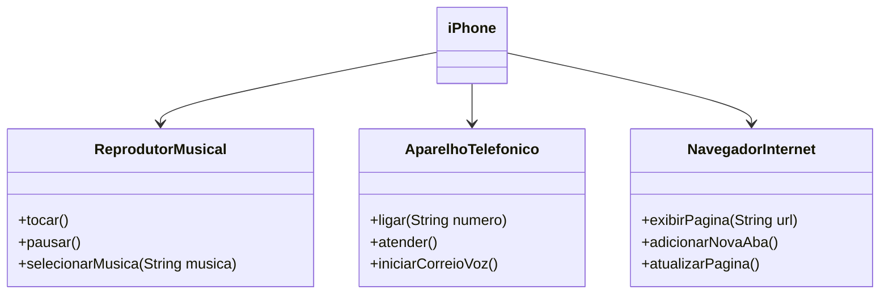

# Diagrama UML do Projeto

Este projeto implementa um modelo de classes que simula as funcionalidades de um dispositivo, como um iPhone. O diagrama UML abaixo ilustra as interfaces e a classe principal (`iPhone`) que as implementa.

## Descrição das Interfaces

### ReprodutorMusical
Esta interface representa as funcionalidades básicas de um reprodutor musical. Os métodos incluídos são:
- `tocar()`: Inicia a reprodução da música.
- `pausar()`: Pausa a música que está sendo reproduzida.
- `selecionarMusica(String musica)`: Seleciona a música que será reproduzida.

### AparelhoTelefonico
Esta interface define os métodos para as operações de um aparelho telefônico. Os métodos incluídos são:
- `ligar(String numero)`: Realiza uma ligação para o número fornecido.
- `atender()`: Atende uma chamada entrante.
- `iniciarCorreioVoz()`: Inicia o serviço de correio de voz.

### NavegadorInternet
Esta interface representa as operações básicas de um navegador de internet. Os métodos incluídos são:
- `exibirPagina(String url)`: Exibe a página da URL fornecida.
- `adicionarNovaAba()`: Adiciona uma nova aba no navegador.
- `atualizarPagina()`: Atualiza a página atual.

## Classe `iPhone`

A classe `iPhone` implementa as três interfaces (`ReprodutorMusical`, `AparelhoTelefonico` e `NavegadorInternet`), encapsulando as funcionalidades de um dispositivo moderno que atua como reprodutor musical, aparelho telefônico e navegador de internet.

Nesse diagrama, podemos observar que a classe `iPhone` está relacionada com cada uma das interfaces mencionadas, indicando que ela deve implementar todos os métodos definidos por essas interfaces. Essa estrutura facilita a manutenção e a escalabilidade do código, permitindo que o iPhone simule de maneira eficaz as funções de um dispositivo multifuncional.

## Como Usar

Este projeto pode ser utilizado como base para entender a implementação de interfaces em Java e como diferentes funcionalidades podem ser organizadas em um único dispositivo através de um modelo orientado a objetos.